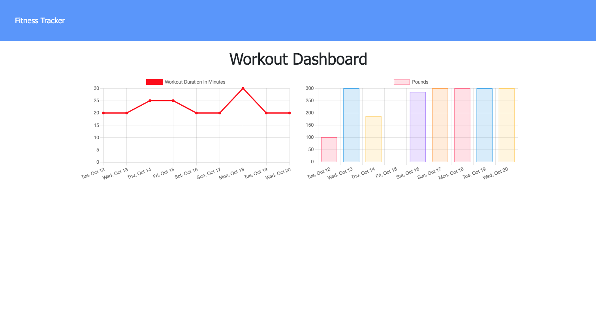

# Fitness Tracker

## Description

This web-application allows the user to view, create, and track daily workouts. They can log mutliple exercises in a single workout per day. There are two main options: cardio and resistance. The user can track the name, type, weight, sets, reps and duration of the resistance exercise. If the workout is cardio based, the user can track the distance and duration traveled.

## Table of Contents

- [Installation](#installation)
- [Usage](#usage)
- [Technology](#technology)
- [License](#license)
- [Contact](#contact)

## Deployed Website

[Fitness Tracker](https://secure-retreat-27936.herokuapp.com/stats)

## Installation

1. Clone this repository from Github
2. From the terminal run `npm install` to install node packages.
3. Run `node server.js` in the command line.
4. Access your localhost on your machine to use the Fitness Tracker!

## Usage

| Home Page                                              | Workout Dashboard                                               |
| ------------------------------------------------------ | --------------------------------------------------------------- |
|  |  |

## Technology

**1. [MongoDB](https://www.mongodb.com/)** :

- MongoDB is a general purpose, document-based, distributed database built for modern application developers and for the cloud era.

- MongoDB is a document database, which means it stores data in JSON-like documents.

**2. [Mongoose](https://mongoosejs.com/)** :

- MongoDB object modeling for node.js.

- Mongoose provides a straight-forward, schema-based solution to model your application data. It includes built-in type casting, validation, query building, business logic hooks and more.

**3. [Express.js](https://expressjs.com/)** :

- Web Applications : Express is a minimal and flexible Node.js web application framework that provides a robust set of features for web and mobile applications.

- APIs : With a myriad of HTTP utility methods and middleware, creating a robust API is quick and easy.

**4. [Node.js](https://nodejs.org/en/)** :

- Node.js is an open-source and cross-platform JavaScript runtime environment.

- A Node.js app is run in a single process, without creating a new thread for every request.

## License

This project is licensed under the terms of the MIT license.

## Contact

Let's Connect! Reach me on:

- [Github](https://github.com/evanarbour)
- [LinkedIn](https://www.linkedin.com/in/evan-arbour/)
- [Email](evan.arbour@gmail.com)
